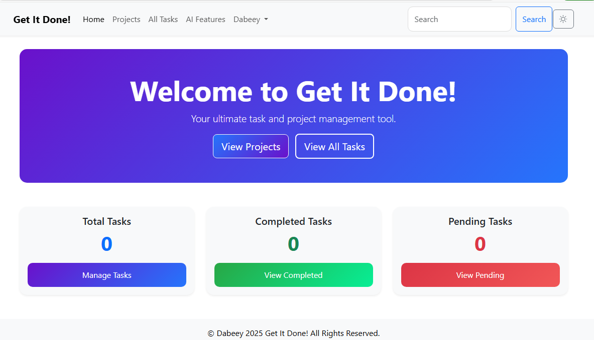

# Get It Done! – Modern Task Manager



**Get It Done!** is a modern, AI-powered productivity and task management web app built with Flask, Bootstrap, and Groq AI integration.  
It features a beautiful glassmorphism UI, project-based organization, and smart task creation with natural language.

---

## 🚀 Features

- **Ultra-modern UI:** Glassmorphism, gradients, responsive design, and smooth interactions.
- **Project Organization:** Group tasks by projects and filter easily.
- **AI Task Creation:** Generate tasks from natural language using Groq AI.
- **Manual & AI Task Entry:** Add tasks manually or with AI suggestions.
- **Status Management:** Mark tasks as Pending, Ongoing, or Done with modern circular selectors.
- **Filter Bar:** Instantly filter tasks by date, status, or overdue.
- **Edit & Delete:** Quickly update or remove tasks.
- **Mobile Friendly:** Works beautifully on all devices.

---

## 🛠️ Setup

1. **Clone the repository:**
    ```sh
    git clone https://github.com/yourusername/get-it-done.git
    cd get-it-done
    ```

2. **Create a virtual environment and activate it:**
    ```sh
    python -m venv venv
    venv\Scripts\activate  # On Windows
    # or
    source venv/bin/activate  # On Mac/Linux
    ```

3. **Install dependencies:**
    ```sh
    pip install -r requirements.txt
    ```

4. **Set up environment variables:**
    - Create a `.env` file in the root directory.
    - Add your Groq API key and Flask secret:
      ```
      GROQ_API_KEY=your_groq_api_key_here
      SECRET_KEY=your_flask_secret_key_here
      ```

5. **Initialize the database:**
    ```sh
    flask db upgrade
    ```

6. **Run the app:**
    ```sh
    flask run
    ```

7. **Visit:**  
    [http://localhost:5000](http://localhost:5000)

---

## 🤖 AI Task Creation

- Go to the **AI Task Creator** page.
- Enter a natural language description (e.g., "Finish report by Friday, high priority").
- Select a project and click **Create Task**.
- The AI will generate a structured task with a due date and priority.

---

## 📁 Project Structure

```
get-it-done/
│
├── main.py
├── models.py
├── requirements.txt
├── .env
├── /templates
│   ├── base.html
│   ├── tasks.html
│   ├── ai.html
│   └── ...
├── /static
│   ├── js/
│   ├── css/
│   └── ...
└── README.md
```

---

## ✨ Customization

- **Colors & Branding:**  
  Edit the CSS in your templates or `/static/css/` for your brand colors.
- **AI Model:**  
  You can adjust the prompt or model in `main.py` for different AI behaviors.

---

## 📝 License

MIT License

---

## 🙏 Credits

- [Bootstrap](https://getbootstrap.com/)
- [Groq AI](https://groq.com/)
- [Flask](https://flask.palletsprojects.com/)
- [Open Source Icons](https://icons.getbootstrap.com/)

---

Enjoy your productivity boost with **Get It Done!** 🚀